# 🏷️ Image Labels Generator using Amazon Rekognition

This project uses **Amazon Rekognition** and **Amazon S3** to analyze images and automatically generate object labels. It’s a beginner-friendly way to explore AWS AI services like Rekognition, ideal for practical use cases like surveillance, product detection, and accessibility tools.

---

## 🖼️ Demo Screenshots

| Upload to S3 | AWS Rekognition Call | Output with Labels |
|--------------|----------------------|---------------------|
| 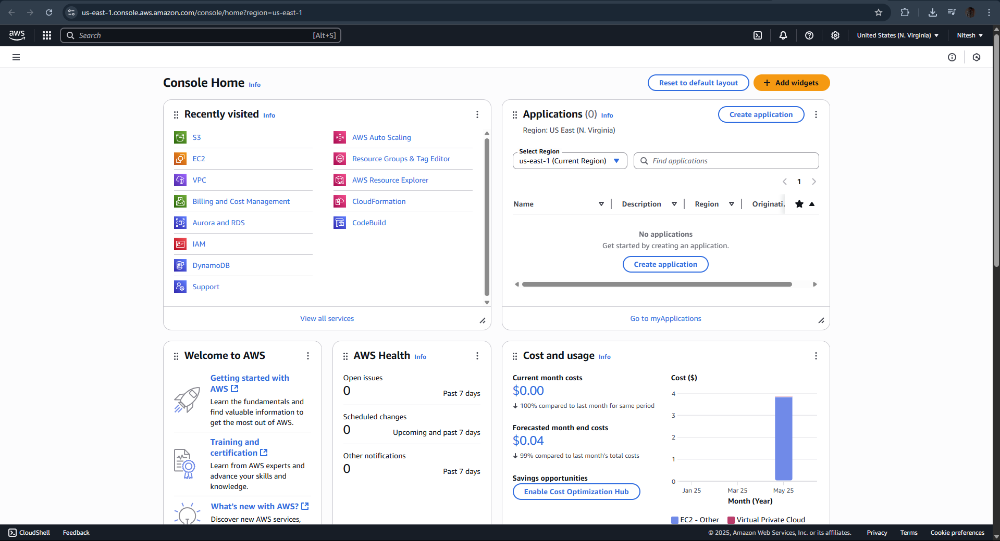 | 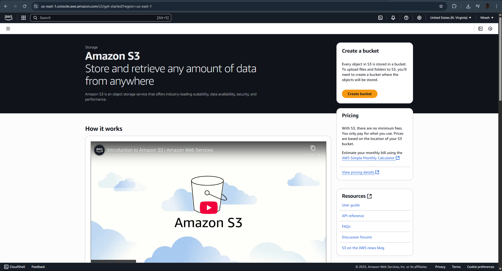 | 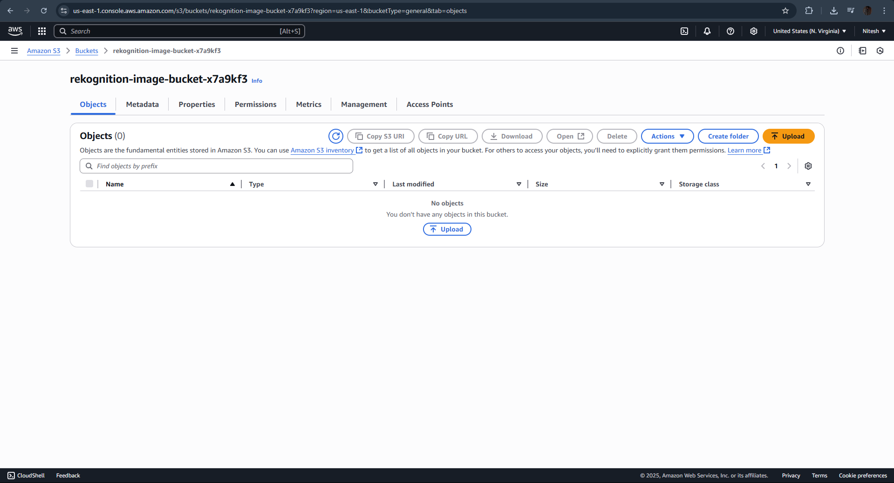 |
| 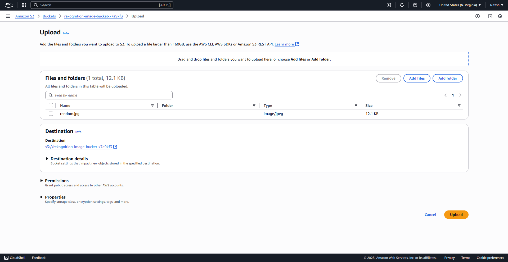 | 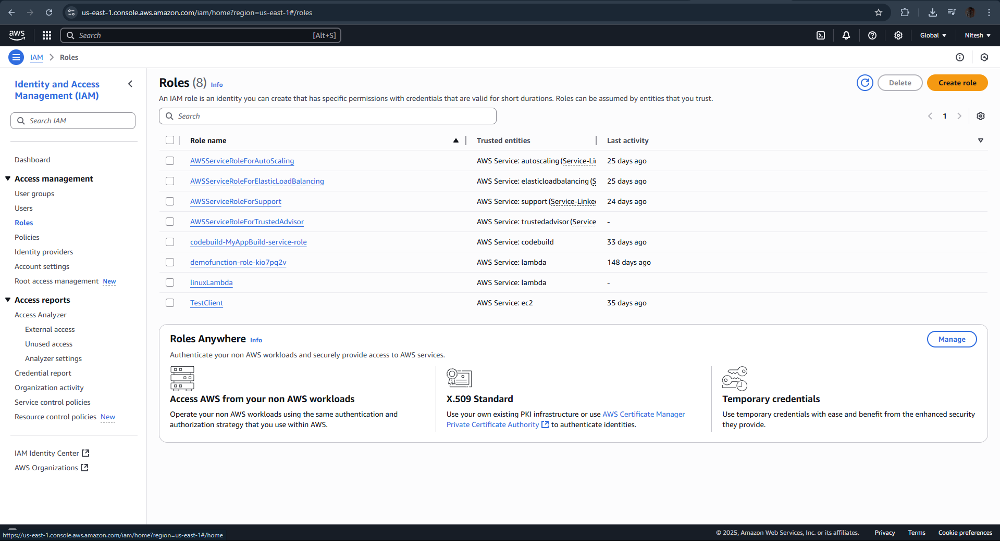 | 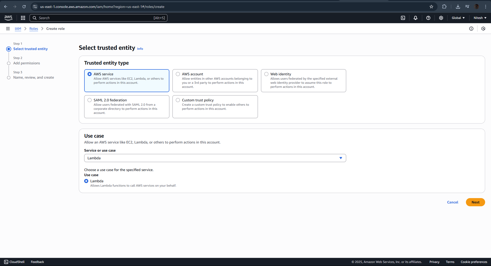 |
|  | 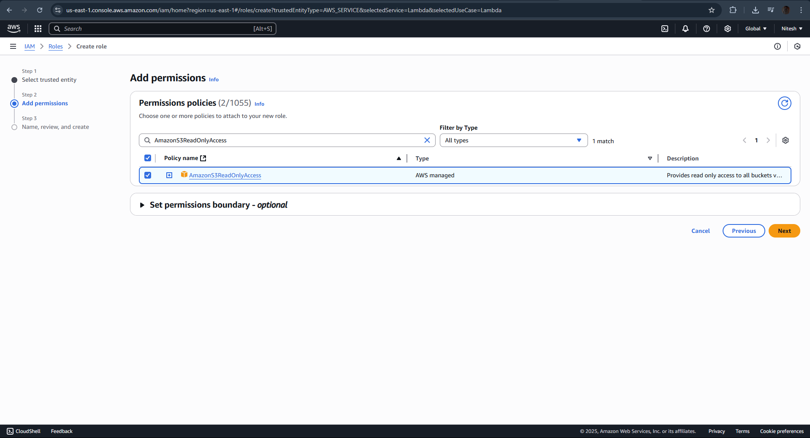 | 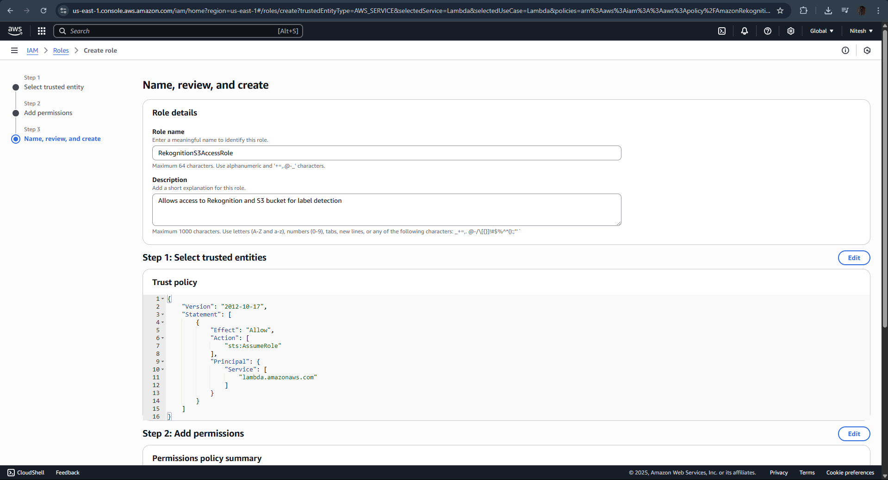 |
| 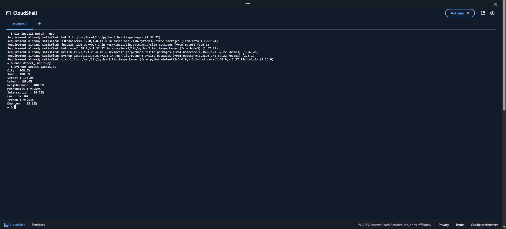 | 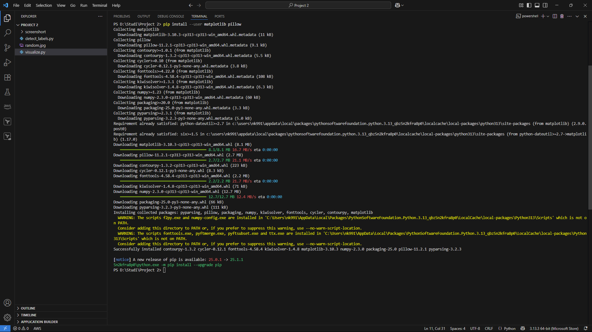 | 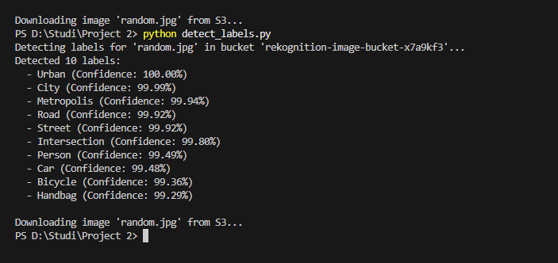 |
| 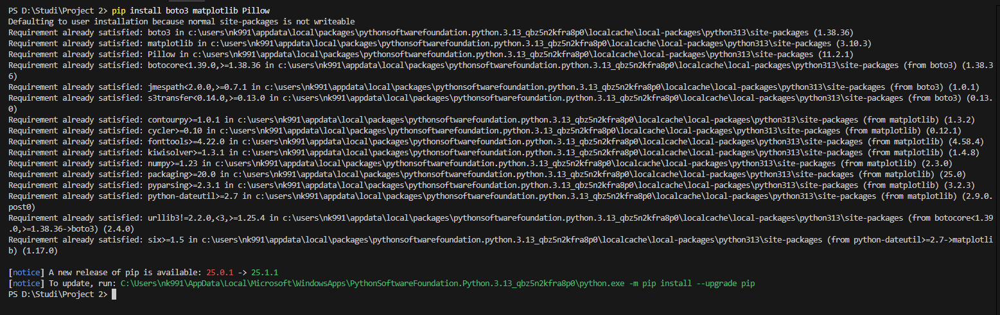 |  |  |

---

## 🚀 Features

- Upload images to an S3 bucket
- Detect objects using Amazon Rekognition’s `detect_labels`
- Visualize results with bounding boxes and labels using Matplotlib
- Customize confidence threshold and label limits
- Easily extend for real-world applications

---

## 📦 Requirements

- AWS Account
- IAM user with permissions: `AmazonS3FullAccess` and `AmazonRekognitionFullAccess`
- Python 3.7 or higher
- AWS CLI configured with your credentials
- Install dependencies from `requirements.txt`:

```bash
pip install -r requirements.txt
